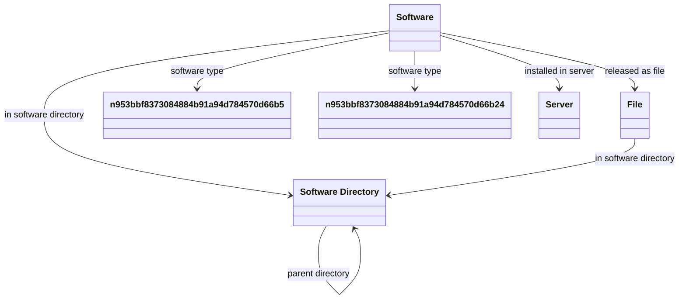

```mermaid
	classDiagram

    
    class `Software` {
    
    }

    class `Software Directory` {
    
    }

    class `File` {
    
    }

    class `n953bbf8373084884b91a94d784570d66b5` {
    
    }

    class `n953bbf8373084884b91a94d784570d66b24` {
    
    }

    class `Server` {
    
    }


`Software`  --> `Software Directory`   :in software directory  

`Software`  --> `n953bbf8373084884b91a94d784570d66b5`   :software type  

`File`  --> `Software Directory`   :in software directory  

`Software`  --> `n953bbf8373084884b91a94d784570d66b24`   :software type  

`Software Directory`  --> `Software Directory`   :parent directory  

`Software`  --> `Server`   :installed in server  

`Software`  --> `File`   :released as file  

```