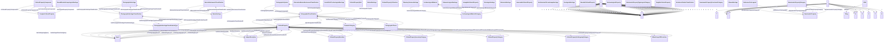

```mermaid
	classDiagram

    
    class CartographicSymbol {
    
    }

    class DemoEthnoAnthropologicalHeritage {
    
    }

    class PhotographicHeritage {
    
    }

    class CulturalPropertyComponent {
    
    }

    class MusicalInstrumentClassification {
    
    }

    class AlternativeMusicalInstrumentClassification {
    
    }

    class ScientificOrTechnologicalHeritage {
    
    }

    class ComplexCulturalProperty {
    
    }

    class CulturalPropertyPart {
    
    }

    class NaturalHeritage {
    
    }

    class PhotographicHeritageClassification {
    
    }

    class CulturalPropertyCollection {
    
    }

    class CulturalPropertyResidual {
    
    }

    class MusicHeritage {
    
    }

    class PlanetaryScienceHeritage {
    
    }

    class ArchaeologicalMaterial {
    
    }

    class CulturalPropertyCategory {
    
    }

    class CartographicClassification {
    
    }

    class PalaeontologicalHeritage {
    
    }

    class IntangibleCulturalProperty {
    
    }

    class PhotographicHeritageClassificationType {
    
    }

    class CulturalProperty {
    
    }

    class PetrologicHeritage {
    
    }

    class BotanicalHeritage {
    
    }

    class CulturalPropertyInventoryCategory {
    
    }

    class ImmovableCulturalProperty {
    
    }

    class ArchitecturalOrLandscapeHeritage {
    
    }

    class MibacScopeOfProtection {
    
    }

    class ZoologicalHeritage {
    
    }

    class MovableCulturalProperty {
    
    }

    class NumismaticPropertyCategory {
    
    }

    class ArchaeologicalProperty {
    
    }

    class NumismaticPropertyTypologicalCategory {
    
    }

    class TangibleCulturalProperty {
    
    }

    class HornbostelSachsClassification {
    
    }

    class ArchaeologicalMaterialCategory {
    
    }

    class NumismaticPropertyFunctionalCategory {
    
    }

    class CulturalPropertyCataloguingCategory {
    
    }

    class MineralHeritage {
    
    }


h  --> s   :a  

h  --> s   :a  

PhotographicHeritageClassificationType  --> PhotographicHeritageClassification   :isPhotographicHeritageClassificationTypeOf  

h  --> s   :a  

h  --> s   :a  

h  --> s   :a  

ArchaeologicalMaterial  --> ArchaeologicalMaterialCategory   :hasArchaeologicalMaterialCategory  

CulturalProperty  --> Agent   :hasCataloguingAgency  

h  --> s   :a  

h  --> s   :a  

h  --> s   :a  

CulturalProperty  --> SubjectDiscipline   :hasAlternativeDiscipline  

PhotographicHeritageClassificationType  --> PhotographicHeritageClassification   :isPhotographicHeritageClassificationTypeOf  

CartographicClassification  --> CulturalProperty   :isCartographicClassificationOf  

CulturalProperty  --> SubjectDiscipline   :hasMainDiscipline  

PhotographicHeritage  --> PhotographicHeritageClassification   :hasPhotographicHeritageClassification  

h  --> s   :a  

i  --> T   :s  

h  --> s   :a  

h  --> s   :a  

h  --> s   :a  

h  --> s   :a  

CulturalProperty  --> CulturalPropertyResidual   :hasCulturalPropertyResidual  

CulturalProperty  --> SubjectDiscipline   :hasAlternativeDiscipline  

MibacScopeOfProtection  --> CulturalProperty   :isMibacScopeOfProtectionOf  

i  --> C   :s  

h  --> s   :a  

h  --> s   :a  

Agent  --> CulturalProperty   :isHeritageProtectionAgencyOf  

CulturalProperty  --> CulturalPropertyInventoryCategory   :hasCulturalPropertyInventoryCategory  

h  --> s   :a  

h  --> s   :a  

CulturalPropertyComponent  --> ComplexCulturalProperty   :isCulturalPropertyComponentOf  

h  --> s   :a  

h  --> s   :a  

h  --> s   :a  

ThematicCategory  --> CartographicClassification   :isThematicCategoryOf  

h  --> s   :a  

CartographicSymbol  --> CartographicClassification   :isCartographicSymbolOf  

CartographicClassification  --> CartographicSymbol   :hasCartographicSymbol  

NumismaticProperty  --> NumismaticPropertyCategory   :hasNumismaticPropertyCategory  

h  --> s   :a  

CulturalProperty  --> CulturalPropertyCategory   :hasCulturalPropertyCategory  

h  --> s   :a  

h  --> s   :a  

CulturalPropertyResidual  --> CulturalProperty   :isCulturalPropertyResidualOf  

h  --> s   :a  

h  --> s   :a  

RFId  --> Thing   :isRFIdOf  

h  --> s   :a  

i  --> M   :s  

h  --> s   :a  

CulturalPropertyInventoryCategory  --> CulturalProperty   :isCulturalPropertyInventoryCategoryOf  

CulturalProperty  --> CulturalPropertyResidual   :hasCulturalPropertyResidual  

PhotographicHeritageClassification  --> PhotographicHeritage   :isPhotographicHeritageClassificationOf  

CulturalPropertyCataloguingCategory  --> CulturalProperty   :isCulturalPropertyCataloguingCategoryOf  

ArchaeologicalMaterialCategory  --> ArchaeologicalMaterial   :isArchaeologicalMaterialCategoryOf  

h  --> s   :a  

i  --> C   :s  

MusicHeritage  --> MusicalInstrumentClassification   :hasMusicalInstrumentClassification  

h  --> s   :a  

NumismaticPropertyCategory  --> NumismaticProperty   :isNumismaticPropertyCategoryOf  

PhotographicHeritageClassification  --> PhotographicHeritage   :isPhotographicHeritageClassificationOf  

CulturalProperty  --> CulturalPropertyCataloguingCategory   :hasCulturalPropertyCataloguingCategory  

h  --> s   :a  

i  --> C   :s  

CulturalProperty  --> CulturalPropertyInventoryCategory   :hasCulturalPropertyInventoryCategory  

h  --> s   :a  

h  --> s   :a  

i  --> C   :s  

h  --> s   :a  

CulturalPropertyComponent  --> ComplexCulturalProperty   :isCulturalPropertyComponentOf  

h  --> s   :a  

h  --> s   :a  

MibacScopeOfProtection  --> CulturalProperty   :isMibacScopeOfProtectionOf  

i  --> R   :s  

h  --> s   :a  

i  --> C   :s  

h  --> s   :a  

h  --> s   :a  

PhotographicHeritageClassification  --> PhotographicHeritageClassificationType   :hasPhotographicHeritageClassificationType  

CulturalProperty  --> Agent   :hasHeritageProtectionAgency  

i  --> A   :s  

h  --> s   :a  

CulturalProperty  --> SubjectDiscipline   :hasMainDiscipline  

h  --> s   :a  

SubjectDiscipline  --> CulturalProperty   :isMainDisciplineOf  

h  --> s   :a  

i  --> P   :s  

h  --> s   :a  

h  --> s   :a  

Agent  --> CulturalProperty   :isHeritageProtectionAgencyOf  

CulturalProperty  --> CartographicClassification   :hasCartographicClassification  

i  --> P   :s  

CulturalProperty  --> MibacScopeOfProtection   :hasMibacScopeOfProtection  

h  --> s   :a  

h  --> s   :a  

ArchaeologicalMaterialCategory  --> ArchaeologicalMaterial   :isArchaeologicalMaterialCategoryOf  

CartographicSymbol  --> CartographicClassification   :isCartographicSymbolOf  

PhotographicHeritage  --> PhotographicHeritageClassification   :hasPhotographicHeritageClassification  

h  --> s   :a  

h  --> s   :a  

i  --> M   :s  

Agent  --> CulturalProperty   :isCataloguingAgencyOf  

h  --> s   :a  

ComplexCulturalProperty  --> CulturalPropertyComponent   :hasCulturalPropertyComponent  

i  --> N   :s  

h  --> s   :a  

Agent  --> CulturalProperty   :isRelatedAgencyOf  

CulturalProperty  --> Agent   :hasRelatedAgency  

ReferenceCoinLegend  --> NumismaticProperty   :isReferenceCoinLegendOf  

NumismaticPropertyCategory  --> NumismaticProperty   :isNumismaticPropertyCategoryOf  

CulturalProperty  --> Agent   :hasHeritageProtectionAgency  

Agent  --> CulturalProperty   :isCataloguingAgencyOf  

CulturalProperty  --> MibacScopeOfProtection   :hasMibacScopeOfProtection  

h  --> s   :a  

CartographicClassification  --> CartographicSymbol   :hasCartographicSymbol  

MusicalInstrumentClassification  --> MusicHeritage   :isMusicalInstrumentClassificationOf  

i  --> C   :s  

ComplexCulturalProperty  --> CulturalPropertyComponent   :hasCulturalPropertyComponent  

h  --> s   :a  

Agent  --> CulturalProperty   :isRelatedAgencyOf  

SubjectDiscipline  --> CulturalProperty   :isMainDisciplineOf  

h  --> s   :a  

h  --> s   :a  

CartographicClassification  --> CartographicTheme   :hasCartographicTheme  

h  --> s   :a  

CulturalPropertyResidual  --> CulturalProperty   :isCulturalPropertyResidualOf  

CulturalProperty  --> CulturalPropertyCataloguingCategory   :hasCulturalPropertyCataloguingCategory  

i  --> C   :s  

h  --> s   :a  

CulturalPropertyCategory  --> CulturalProperty   :isCulturalPropertyCategoryOf  

CulturalProperty  --> CulturalPropertyCategory   :hasCulturalPropertyCategory  

CulturalPropertyInventoryCategory  --> CulturalProperty   :isCulturalPropertyInventoryCategoryOf  

ArchaeologicalMaterial  --> ArchaeologicalMaterialCategory   :hasArchaeologicalMaterialCategory  

h  --> s   :a  

h  --> s   :a  

h  --> s   :a  

ThematicCategory  --> CartographicClassification   :isThematicCategoryOf  

MusicHeritage  --> MusicalInstrumentClassification   :hasMusicalInstrumentClassification  

CulturalPropertyCategory  --> CulturalProperty   :isCulturalPropertyCategoryOf  

SubjectDiscipline  --> CulturalProperty   :isAlternativeDisciplineOf  

h  --> s   :a  

MusicalInstrumentClassification  --> MusicHeritage   :isMusicalInstrumentClassificationOf  

CartographicTheme  --> CartographicClassification   :isCartographicThemeOf  

CartographicClassification  --> CulturalProperty   :isCartographicClassificationOf  

i  --> M   :s  

h  --> s   :a  

CulturalPropertyCataloguingCategory  --> CulturalProperty   :isCulturalPropertyCataloguingCategoryOf  

CulturalProperty  --> Agent   :hasCataloguingAgency  

SubjectDiscipline  --> CulturalProperty   :isAlternativeDisciplineOf  

CartographicTheme  --> CartographicClassification   :isCartographicThemeOf  

CartographicClassification  --> ThematicCategory   :hasThematicCategory  

PhotographicHeritageClassification  --> PhotographicHeritageClassificationType   :hasPhotographicHeritageClassificationType  

NumismaticProperty  --> NumismaticPropertyCategory   :hasNumismaticPropertyCategory  

i  --> M   :s  

CulturalProperty  --> CartographicClassification   :hasCartographicClassification  

i  --> R   :s  

```