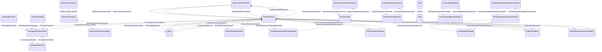

```mermaid
	classDiagram

    
    class MibacScopeOfProtection {
    
    }


MibacScopeOfProtection  --> CulturalProperty   :isMibacScopeOfProtectionOf  

CartographicClassification  --> CartographicSymbol   :hasCartographicSymbol  

MibacScopeOfProtection  --> CulturalProperty   :isMibacScopeOfProtectionOf  

CartographicTheme  --> CartographicClassification   :isCartographicThemeOf  

PhotographicHeritageClassificationType  --> PhotographicHeritageClassification   :isPhotographicHeritageClassificationTypeOf  

NumismaticProperty  --> NumismaticPropertyCategory   :hasNumismaticPropertyCategory  

CulturalProperty  --> Agent   :hasHeritageProtectionAgency  

CulturalProperty  --> CartographicClassification   :hasCartographicClassification  

NumismaticPropertyCategory  --> NumismaticProperty   :isNumismaticPropertyCategoryOf  

ReferenceCoinLegend  --> NumismaticProperty   :isReferenceCoinLegendOf  

CulturalProperty  --> MibacScopeOfProtection   :hasMibacScopeOfProtection  

CulturalPropertyResidual  --> CulturalProperty   :isCulturalPropertyResidualOf  

CulturalProperty  --> MibacScopeOfProtection   :hasMibacScopeOfProtection  

MusicalInstrumentClassification  --> MusicHeritage   :isMusicalInstrumentClassificationOf  

CulturalPropertyComponent  --> ComplexCulturalProperty   :isCulturalPropertyComponentOf  

CulturalProperty  --> CulturalPropertyResidual   :hasCulturalPropertyResidual  

CulturalProperty  --> CulturalPropertyCataloguingCategory   :hasCulturalPropertyCataloguingCategory  

CulturalPropertyCataloguingCategory  --> CulturalProperty   :isCulturalPropertyCataloguingCategoryOf  

CulturalPropertyCategory  --> CulturalProperty   :isCulturalPropertyCategoryOf  

PhotographicHeritage  --> PhotographicHeritageClassification   :hasPhotographicHeritageClassification  

CulturalProperty  --> SubjectDiscipline   :hasAlternativeDiscipline  

CartographicClassification  --> CulturalProperty   :isCartographicClassificationOf  

RFId  --> Thing   :isRFIdOf  

CulturalProperty  --> CulturalPropertyCategory   :hasCulturalPropertyCategory  

MibacScopeOfProtection  --> CulturalProperty   :isMibacScopeOfProtectionOf  

PhotographicHeritageClassification  --> PhotographicHeritage   :isPhotographicHeritageClassificationOf  

SubjectDiscipline  --> CulturalProperty   :isAlternativeDisciplineOf  

ArchaeologicalMaterial  --> ArchaeologicalMaterialCategory   :hasArchaeologicalMaterialCategory  

CulturalPropertyInventoryCategory  --> CulturalProperty   :isCulturalPropertyInventoryCategoryOf  

Agent  --> CulturalProperty   :isRelatedAgencyOf  

SubjectDiscipline  --> CulturalProperty   :isMainDisciplineOf  

ThematicCategory  --> CartographicClassification   :isThematicCategoryOf  

CulturalProperty  --> Agent   :hasCataloguingAgency  

ArchaeologicalMaterialCategory  --> ArchaeologicalMaterial   :isArchaeologicalMaterialCategoryOf  

CulturalProperty  --> CulturalPropertyInventoryCategory   :hasCulturalPropertyInventoryCategory  

PhotographicHeritageClassification  --> PhotographicHeritageClassificationType   :hasPhotographicHeritageClassificationType  

CulturalProperty  --> SubjectDiscipline   :hasMainDiscipline  

MusicHeritage  --> MusicalInstrumentClassification   :hasMusicalInstrumentClassification  

ComplexCulturalProperty  --> CulturalPropertyComponent   :hasCulturalPropertyComponent  

CartographicSymbol  --> CartographicClassification   :isCartographicSymbolOf  

Agent  --> CulturalProperty   :isHeritageProtectionAgencyOf  

Agent  --> CulturalProperty   :isCataloguingAgencyOf  

```