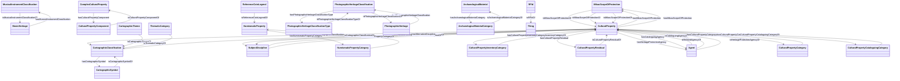

```mermaid
	classDiagram

    
    class MibacScopeOfProtection {
    
    }


MusicalInstrumentClassification  --> MusicHeritage   :isMusicalInstrumentClassificationOf  

ComplexCulturalProperty  --> CulturalPropertyComponent   :hasCulturalPropertyComponent  

CartographicSymbol  --> CartographicClassification   :isCartographicSymbolOf  

CulturalPropertyComponent  --> ComplexCulturalProperty   :isCulturalPropertyComponentOf  

CulturalProperty  --> CartographicClassification   :hasCartographicClassification  

CulturalProperty  --> SubjectDiscipline   :hasMainDiscipline  

NumismaticProperty  --> NumismaticPropertyCategory   :hasNumismaticPropertyCategory  

CartographicClassification  --> CartographicSymbol   :hasCartographicSymbol  

MusicHeritage  --> MusicalInstrumentClassification   :hasMusicalInstrumentClassification  

CulturalPropertyInventoryCategory  --> CulturalProperty   :isCulturalPropertyInventoryCategoryOf  

CulturalProperty  --> MibacScopeOfProtection   :hasMibacScopeOfProtection  

CulturalProperty  --> MibacScopeOfProtection   :hasMibacScopeOfProtection  

CulturalProperty  --> CulturalPropertyResidual   :hasCulturalPropertyResidual  

SubjectDiscipline  --> CulturalProperty   :isAlternativeDisciplineOf  

MibacScopeOfProtection  --> CulturalProperty   :isMibacScopeOfProtectionOf  

MibacScopeOfProtection  --> CulturalProperty   :isMibacScopeOfProtectionOf  

CartographicTheme  --> CartographicClassification   :isCartographicThemeOf  

Agent  --> CulturalProperty   :isRelatedAgencyOf  

SubjectDiscipline  --> CulturalProperty   :isMainDisciplineOf  

CulturalPropertyCategory  --> CulturalProperty   :isCulturalPropertyCategoryOf  

PhotographicHeritageClassification  --> PhotographicHeritageClassificationType   :hasPhotographicHeritageClassificationType  

NumismaticPropertyCategory  --> NumismaticProperty   :isNumismaticPropertyCategoryOf  

CulturalProperty  --> CulturalPropertyCataloguingCategory   :hasCulturalPropertyCataloguingCategory  

Agent  --> CulturalProperty   :isCataloguingAgencyOf  

Agent  --> CulturalProperty   :isHeritageProtectionAgencyOf  

MibacScopeOfProtection  --> CulturalProperty   :isMibacScopeOfProtectionOf  

CulturalProperty  --> CulturalPropertyInventoryCategory   :hasCulturalPropertyInventoryCategory  

PhotographicHeritageClassificationType  --> PhotographicHeritageClassification   :isPhotographicHeritageClassificationTypeOf  

ReferenceCoinLegend  --> NumismaticProperty   :isReferenceCoinLegendOf  

PhotographicHeritage  --> PhotographicHeritageClassification   :hasPhotographicHeritageClassification  

CulturalProperty  --> CulturalPropertyCategory   :hasCulturalPropertyCategory  

ArchaeologicalMaterial  --> ArchaeologicalMaterialCategory   :hasArchaeologicalMaterialCategory  

CartographicClassification  --> CulturalProperty   :isCartographicClassificationOf  

RFId  --> Thing   :isRFIdOf  

CulturalProperty  --> Agent   :hasHeritageProtectionAgency  

CulturalPropertyResidual  --> CulturalProperty   :isCulturalPropertyResidualOf  

PhotographicHeritageClassification  --> PhotographicHeritage   :isPhotographicHeritageClassificationOf  

CulturalProperty  --> SubjectDiscipline   :hasAlternativeDiscipline  

ThematicCategory  --> CartographicClassification   :isThematicCategoryOf  

ArchaeologicalMaterialCategory  --> ArchaeologicalMaterial   :isArchaeologicalMaterialCategoryOf  

CulturalPropertyCataloguingCategory  --> CulturalProperty   :isCulturalPropertyCataloguingCategoryOf  

CulturalProperty  --> Agent   :hasCataloguingAgency  

```