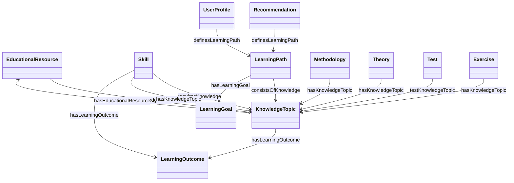

```mermaid
	classDiagram

    


EducationalResource  --> KnowledgeTopic   :hasKnowledgeTopic  

KnowledgeTopic  --> LearningOutcome   :hasLearningOutcome  

Skill  --> KnowledgeTopic   :requiresKnowledge  

LearningPath  --> KnowledgeTopic   :consistsOfKnowledge  

Recommendation  --> LearningPath   :definesLearningPath  

LearningPath  --> LearningGoal   :hasLearningGoal  

KnowledgeTopic  --> EducationalResource   :hasEducationalResource  

Skill  --> KnowledgeTopic   :hasKnowledgeTopic  

UserProfile  --> LearningPath   :definesLearningPath  

Methodology  --> KnowledgeTopic   :hasKnowledgeTopic  

Skill  --> LearningOutcome   :hasLearningOutcome  

Theory  --> KnowledgeTopic   :hasKnowledgeTopic  

Test  --> KnowledgeTopic   :testKnowledgeTopic  

Exercise  --> KnowledgeTopic   :hasKnowledgeTopic  

```