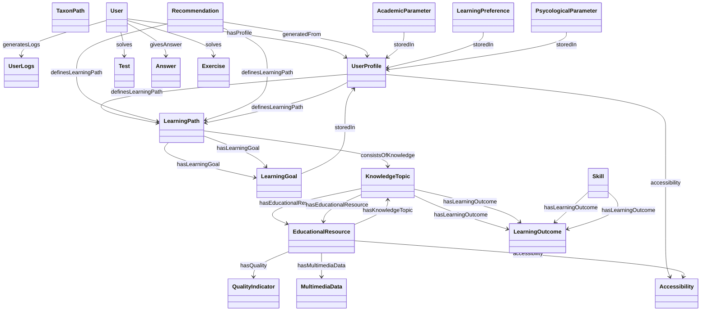

```mermaid
	classDiagram

    
    class UserLogs {
    
    }

    class UserProfile {
    
    }

    class TaxonPath {
    
    }

    class LearningPreference {
    
    }

    class EducationalResource {
    
    }

    class AcademicParameter {
    
    }

    class Recommendation {
    
    }

    class User {
    
    }

    class LearningOutcome {
    
    }

    class LearningGoal {
    
    }

    class LearningPath {
    
    }


KnowledgeTopic  --> EducationalResource   :hasEducationalResource  

UserProfile  --> LearningPath   :definesLearningPath  

Recommendation  --> LearningPath   :definesLearningPath  

LearningPath  --> LearningGoal   :hasLearningGoal  

User  --> UserLogs   :generatesLogs  

UserProfile  --> Accessibility   :accessibility  

User  --> Test   :solves  

KnowledgeTopic  --> LearningOutcome   :hasLearningOutcome  

User  --> UserProfile   :hasProfile  

Recommendation  --> LearningPath   :definesLearningPath  

LearningGoal  --> UserProfile   :storedIn  

EducationalResource  --> QualityIndicator   :hasQuality  

User  --> Answer   :givesAnswer  

KnowledgeTopic  --> LearningOutcome   :hasLearningOutcome  

EducationalResource  --> MultimediaData   :hasMultimediaData  

KnowledgeTopic  --> EducationalResource   :hasEducationalResource  

EducationalResource  --> KnowledgeTopic   :hasKnowledgeTopic  

User  --> Exercise   :solves  

LearningPath  --> LearningGoal   :hasLearningGoal  

Skill  --> LearningOutcome   :hasLearningOutcome  

Recommendation  --> UserProfile   :generatedFrom  

LearningPath  --> KnowledgeTopic   :consistsOfKnowledge  

Skill  --> LearningOutcome   :hasLearningOutcome  

AcademicParameter  --> UserProfile   :storedIn  

EducationalResource  --> Accessibility   :accessibility  

LearningPreference  --> UserProfile   :storedIn  

UserProfile  --> LearningPath   :definesLearningPath  

PsycologicalParameter  --> UserProfile   :storedIn  

```