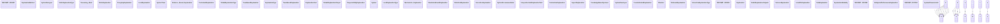

```mermaid
	classDiagram

    
    class OBOOMIT_0006327 {
    
    }

    class ExplanationMethod {
    
    }

    class SystemDesigner {
    
    }

    class StaticExplanationType {
    
    }

    class Reasoning_Mode {
    
    }

    class StaticExplanation {
    
    }

    class EverydayExplanation {
    
    }

    class LocalExplanation {
    
    }

    class SystemTrace {
    
    }

    class Evidence_Based_Explanation {
    
    }

    class ContextualExplanation {
    
    }

    class GlobalExplanationType {
    
    }

    class CaseBasedExplanation {
    
    }

    class ExplanationType {
    
    }

    class TraceBasedExplanation {
    
    }

    class ExplanationGoal {
    
    }

    class GlobalExplanationOutput {
    
    }

    class ResponsibilityExplanation {
    
    }

    class System {
    
    }

    class LocalExplanationType {
    
    }

    class Mechanistic_Explanation {
    
    }

    class SimulationBasedExplanation {
    
    }

    class StatisticalExplanation {
    
    }

    class InteractiveExplanation {
    
    }

    class SystemRecommendation {
    
    }

    class InterprationAndExplanationTask {
    
    }

    class ContrastiveExplanation {
    
    }

    class ImpactExplanation {
    
    }

    class KnowledgeBasedSystems {
    
    }

    class SystemDeveloper {
    
    }

    class CounterfactualExplanation {
    
    }

    class Situation {
    
    }

    class RationaleExplanation {
    
    }

    class InteractiveExplanationType {
    
    }

    class OBOOMIT_0028314 {
    
    }

    class Explanation {
    
    }

    class ModelExplanationOutputs {
    
    }

    class FairnessExplanation {
    
    }

    class scientificExplanation {
    
    }

    class DataExplanation {
    
    }

    class ExplanationModality {
    
    }

    class OBOOMIT_0010354 {
    
    }

    class SafetyAndPerformanceExplanation {
    
    }

    class OBOOMIT_0017046 {
    
    }

    class SystemCharacteristic {
    
    }


S  --> O   :I  

h  --> s   :a  

h  --> s   :a  

S  --> O   :I  

S  --> O   :I  

S  --> O   :I  

h  --> s   :a  

a  --> d   :d  

i  --> B   :s  

S  --> O   :I  

c  --> n   :o  

S  --> O   :I  

S  --> O   :I  

u  --> e   :s  

h  --> s   :a  

S  --> O   :I  

S  --> O   :I  

```