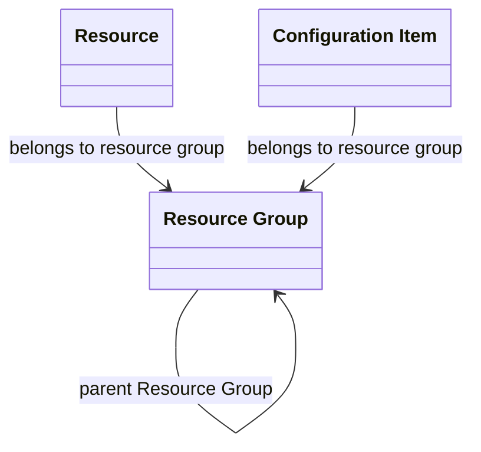

```mermaid
	classDiagram

    
    class `Resource` {
    
    }

    class `Resource Group` {
    
    }

    class `Configuration Item` {
    
    }


`Resource Group`  --> `Resource Group`   :parent Resource Group  

`Resource`  --> `Resource Group`   :belongs to resource group  

`Configuration Item`  --> `Resource Group`   :belongs to resource group  

```