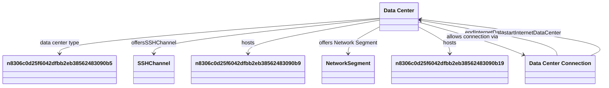

```mermaid
	classDiagram

    
    class `Data Center` {
    
    }

    class `Data Center Connection` {
    
    }

    class `n8306c0d25f6042dfbb2eb38562483090b5` {
    
    }

    class `SSHChannel` {
    
    }

    class `n8306c0d25f6042dfbb2eb38562483090b9` {
    
    }

    class `NetworkSegment` {
    
    }

    class `n8306c0d25f6042dfbb2eb38562483090b19` {
    
    }


`Data Center`  --> `n8306c0d25f6042dfbb2eb38562483090b5`   :data center type  

`Data Center`  --> `SSHChannel`   :offersSSHChannel  

`Data Center`  --> `n8306c0d25f6042dfbb2eb38562483090b9`   :hosts  

`Data Center Connection`  --> `Data Center`   :endInternetDataCenter  

`Data Center`  --> `NetworkSegment`   :offers Network Segment  

`Data Center`  --> `n8306c0d25f6042dfbb2eb38562483090b19`   :hosts  

`Data Center Connection`  --> `Data Center`   :startInternetDataCenter  

`Data Center`  --> `Data Center Connection`   :allows connection via  

```