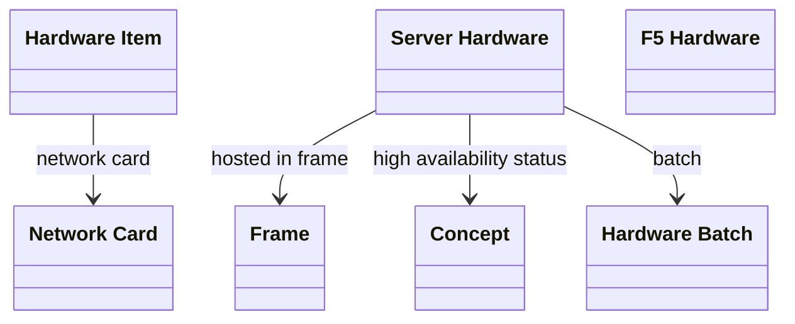

```mermaid
	classDiagram

    
    class `Hardware Item` {
    
    }

    class `Server Hardware` {
    
    }

    class `Hardware Batch` {
    
    }

    class `F5 Hardware` {
    
    }

    class `Frame` {
    
    }

    class `Network Card` {
    
    }

    class `Concept` {
    
    }


`Server Hardware`  --> `Frame`   :hosted in frame  

`Hardware Item`  --> `Network Card`   :network card  

`Server Hardware`  --> `Concept`   :high availability status  

`Server Hardware`  --> `Hardware Batch`   :batch  

```