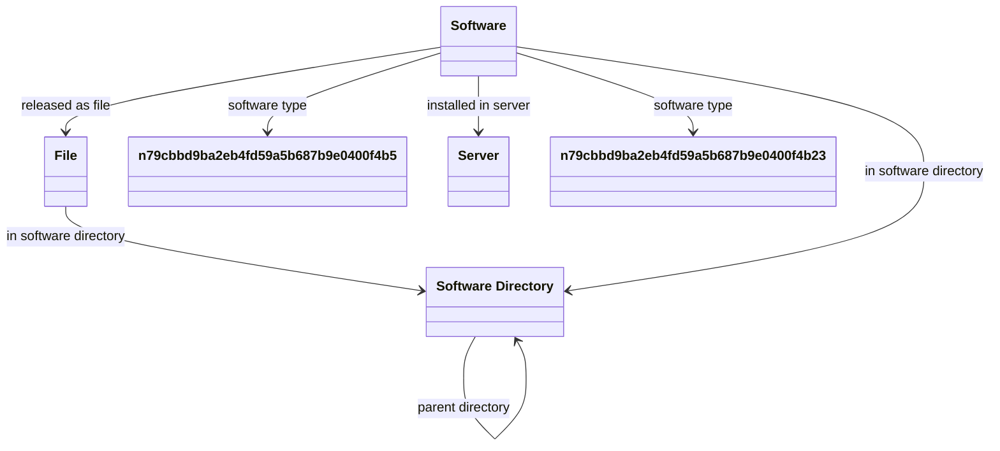

```mermaid
	classDiagram

    
    class `Software` {
    
    }

    class `Software Directory` {
    
    }

    class `File` {
    
    }

    class `n79cbbd9ba2eb4fd59a5b687b9e0400f4b5` {
    
    }

    class `Server` {
    
    }

    class `n79cbbd9ba2eb4fd59a5b687b9e0400f4b23` {
    
    }


`File`  --> `Software Directory`   :in software directory  

`Software`  --> `File`   :released as file  

`Software`  --> `n79cbbd9ba2eb4fd59a5b687b9e0400f4b5`   :software type  

`Software Directory`  --> `Software Directory`   :parent directory  

`Software`  --> `Server`   :installed in server  

`Software`  --> `n79cbbd9ba2eb4fd59a5b687b9e0400f4b23`   :software type  

`Software`  --> `Software Directory`   :in software directory  

```