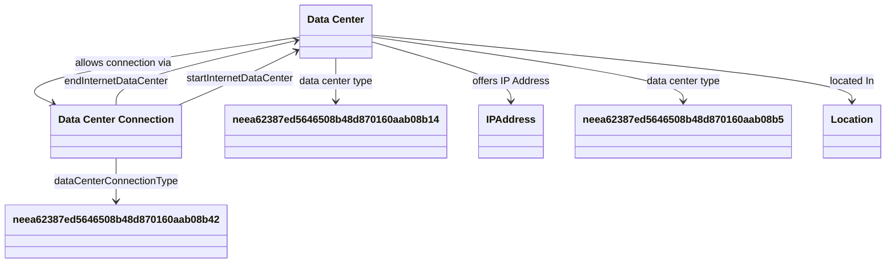

```mermaid
	classDiagram

    
    class `Data Center` {
    
    }

    class `Data Center Connection` {
    
    }

    class `neea62387ed5646508b48d870160aab08b42` {
    
    }

    class `neea62387ed5646508b48d870160aab08b14` {
    
    }

    class `IPAddress` {
    
    }

    class `neea62387ed5646508b48d870160aab08b5` {
    
    }

    class `Location` {
    
    }


`Data Center Connection`  --> `neea62387ed5646508b48d870160aab08b42`   :dataCenterConnectionType  

`Data Center`  --> `neea62387ed5646508b48d870160aab08b14`   :data center type  

`Data Center`  --> `IPAddress`   :offers IP Address  

`Data Center`  --> `neea62387ed5646508b48d870160aab08b5`   :data center type  

`Data Center`  --> `Location`   :located In  

`Data Center Connection`  --> `Data Center`   :endInternetDataCenter  

`Data Center`  --> `Data Center Connection`   :allows connection via  

`Data Center Connection`  --> `Data Center`   :startInternetDataCenter  

```