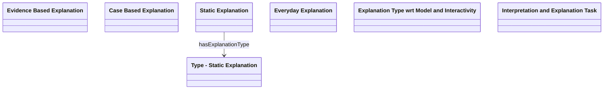

```mermaid
	classDiagram

    
    class `Evidence Based Explanation` {
    
    }

    class `Case Based Explanation` {
    
    }

    class `Static Explanation` {
    
    }

    class `Everyday Explanation` {
    
    }

    class `Explanation Type wrt Model and Interactivity` {
    
    }

    class `Type - Static Explanation` {
    
    }

    class `Interpretation and Explanation Task` {
    
    }


`Static Explanation`  --> `Type - Static Explanation`   :hasExplanationType  

```