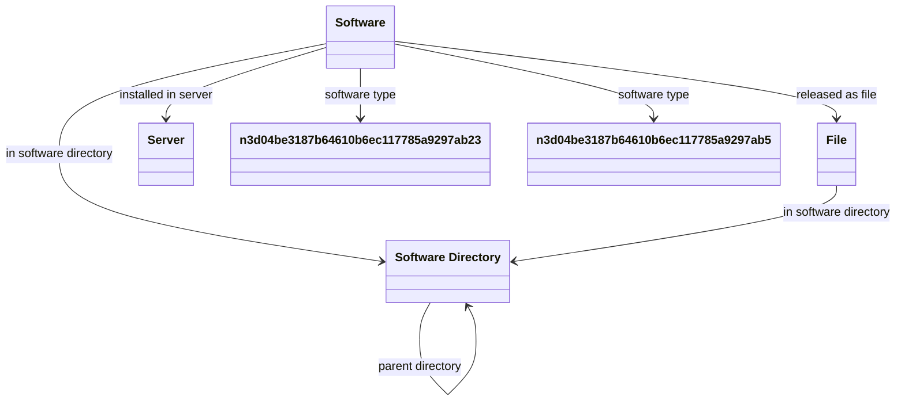

```mermaid
	classDiagram

    
    class `Software` {
    
    }

    class `Software Directory` {
    
    }

    class `File` {
    
    }

    class `Server` {
    
    }

    class `n3d04be3187b64610b6ec117785a9297ab23` {
    
    }

    class `n3d04be3187b64610b6ec117785a9297ab5` {
    
    }


`Software`  --> `Server`   :installed in server  

`Software`  --> `n3d04be3187b64610b6ec117785a9297ab23`   :software type  

`Software`  --> `Software Directory`   :in software directory  

`File`  --> `Software Directory`   :in software directory  

`Software Directory`  --> `Software Directory`   :parent directory  

`Software`  --> `File`   :released as file  

`Software`  --> `n3d04be3187b64610b6ec117785a9297ab5`   :software type  

```