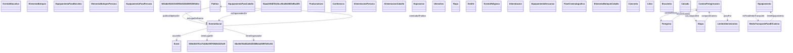

```mermaid
	classDiagram

    
    class EventoEducativo {
    
    }

    class ElementoBotiquin {
    
    }

    class EquipamientoParaBicicleta {
    
    }

    class ElementoBotiquinPersona {
    
    }

    class EquipamientoParaPersona {
    
    }

    class CaminoPeregrinacion {
    
    }

    class Publico {
    
    }

    class EquipamientoParaCaballo {
    
    }

    class Equipamiento {
    
    }

    class ProductoAseo {
    
    }

    class Conferencia {
    
    }

    class AlimentacionPersona {
    
    }

    class EventoSocial {
    
    }

    class AlimentacionCaballo {
    
    }

    class Exposicion {
    
    }

    class Utensilios {
    
    }

    class Ropa {
    
    }

    class Desfile {
    
    }

    class EventoReligioso {
    
    }

    class Alimentacion {
    
    }

    class EquipamientoDescanso {
    
    }

    class PaseCinematografico {
    
    }

    class ElementoBotiquinCaballo {
    
    }

    class Concierto {
    
    }

    class Libro {
    
    }

    class Peregrino {
    
    }

    class Encuentro {
    
    }

    class Calzado {
    
    }


CaminoPeregrinacion  --> Etapa   :SeComponeDe  

CaminoPeregrinacion  --> Peregrino   :caminoRecorridoPor  

CaminoPeregrinacion  --> LimiteAdministrativo   :pasaPor  

Etapa  --> CaminoPeregrinacion   :componeCamino  

Peregrino  --> CaminoPeregrinacion   :recorreCamino  

Publico  --> EventoSocial   :publicoObjetivoDe  

EventoSocial  --> Publico   :orientadoAPublico  

Equipamiento  --> MedioTransporteParaElCamino   :esParaMedioTransporte  

MedioTransporteParaElCamino  --> Equipamiento   :tieneEquipamiento  

EventoSocial  --> Event   :ocurreEn  

EventoSocial  --> N98e300751e714d6c99f7f05863325cf9   :tieneLugarEn  

EventoSocial  --> Nbe9d784d81d6430089b3a55f97b91e53   :tieneOrganizador  

N62a6c962431049f1b524b83891565d1d  --> EventoSocial   :esLugarDeEvento  

Naaa24fdb78e24cc5ba6fa6863dfba385  --> EventoSocial   :esOrganizadorDe  

```