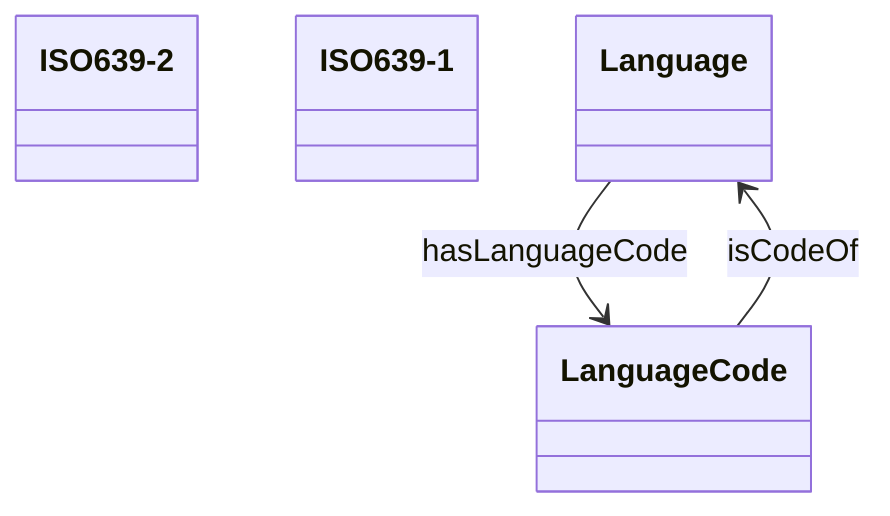

```mermaid
	classDiagram

    
    class ISO639-2 {
    
    }

    class ISO639-1 {
    
    }

    class Language {
    
    }

    class LanguageCode {
    
    }


Language  --> LanguageCode   :hasLanguageCode  

LanguageCode  --> Language   :isCodeOf  

```