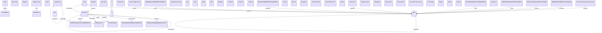

```mermaid
	classDiagram

    
    class Event {
    
    }

    class Manuscript {
    
    }

    class Magazine {
    
    }

    class ThesisDegree {
    
    }

    class N2dd5508e0a954f8b9701c2efe18aad9f {
    
    }

    class Patent {
    
    }

    class Thesis {
    
    }

    class LegalDocument {
    
    }

    class Standard {
    
    }

    class Legislation {
    
    }

    class PersonalCommunicationDocument {
    
    }

    class Event {
    
    }

    class BookSection {
    
    }

    class LegalDecision {
    
    }

    class AudioVisualDocument {
    
    }

    class Document {
    
    }

    class LegalCaseDocument {
    
    }

    class Map {
    
    }

    class Article {
    
    }

    class Image {
    
    }

    class Email {
    
    }

    class Agent {
    
    }

    class Webpage {
    
    }

    class Collection {
    
    }

    class Periodical {
    
    }

    class Interview {
    
    }

    class N394446daa1c34526b49b7570862fd8ac {
    
    }

    class Journal {
    
    }

    class DocumentStatus {
    
    }

    class Hearing {
    
    }

    class N0f7bcaf6b61940158d9e73b84c59970d {
    
    }

    class Newspaper {
    
    }

    class AcademicArticle {
    
    }

    class CollectedDocument {
    
    }

    class Manual {
    
    }

    class Performance {
    
    }

    class N8fcd85ea399a4b4a95b353bc8e13779c {
    
    }

    class AudioDocument {
    
    }

    class EditedBook {
    
    }

    class Specification {
    
    }

    class Note {
    
    }

    class DocumentPart {
    
    }

    class PersonalCommunication {
    
    }

    class RDFSResource {
    
    }

    class Proceedings {
    
    }

    class Chapter {
    
    }

    class Statute {
    
    }

    class Website {
    
    }

    class N2a62cd5c62fb44578207aadaab50f25e {
    
    }

    class Conference {
    
    }

    class N1e5536c5e4f1407cb17cb43d8611d17b {
    
    }


LegalDecision  --> LegalDecision   :subsequentLegalDecision  

Document  --> Event   :presentedAt  

Document  --> Document   :cites  

Document  --> N8fcd85ea399a4b4a95b353bc8e13779c   :editorList  

PersonalCommunicationDocument  --> Agent   :recipient  

Document  --> N0f7bcaf6b61940158d9e73b84c59970d   :contributorList  

Document  --> RDFSResource   :reviewOf  

N2dd5508e0a954f8b9701c2efe18aad9f  --> Agent   :translator  

Document  --> DocumentStatus   :status  

Document  --> Document   :reproducedIn  

N4dac3c94e48c4aedafd2c973cd6e8f20  --> Agent   :producer  

Thesis  --> ThesisDegree   :degree  

LegalDecision  --> LegalDecision   :reversedBy  

Nd8d083af41bd4aa39c04893c9a56b011  --> Agent   :owner  

N22c081deb05b4b7cbc1d3954bf9135f7  --> Agent   :issuer  

Event  --> Agent   :organizer  

Performance  --> Agent   :performer  

N2a62cd5c62fb44578207aadaab50f25e  --> Agent   :distributor  

Event  --> Document   :presents  

LegalDocument  --> Organization   :court  

Agent  --> Agent   :interviewee  

N394446daa1c34526b49b7570862fd8ac  --> Agent   :editor  

Document  --> Document   :citedBy  

Document  --> RDFSResource   :transcriptOf  

Document  --> Document   :translationOf  

Note  --> RDFSResource   :annotates  

AudioVisualDocument  --> Agent   :director  

LegalDecision  --> LegalDecision   :affirmedBy  

Document  --> N1e5536c5e4f1407cb17cb43d8611d17b   :authorList  

Agent  --> Agent   :interviewer  

D  --> T   :C  

```