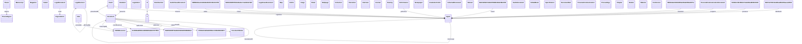

```mermaid
	classDiagram

    
    class Event {
    
    }

    class Manuscript {
    
    }

    class Magazine {
    
    }

    class ThesisDegree {
    
    }

    class Nbbf2226f379a464c90402235386890e6 {
    
    }

    class Patent {
    
    }

    class Thesis {
    
    }

    class LegalDocument {
    
    }

    class N6f896e5eac0e4bd2a0bd0c1b5cb11708 {
    
    }

    class Standard {
    
    }

    class Legislation {
    
    }

    class PersonalCommunicationDocument {
    
    }

    class Event {
    
    }

    class BookSection {
    
    }

    class N745e8c4afda64351be7efdbd94433877 {
    
    }

    class LegalDecision {
    
    }

    class AudioVisualDocument {
    
    }

    class N0b62a9a0104d425ba3fda42994e8071e {
    
    }

    class Document {
    
    }

    class LegalCaseDocument {
    
    }

    class Map {
    
    }

    class Article {
    
    }

    class Image {
    
    }

    class Email {
    
    }

    class Agent {
    
    }

    class Webpage {
    
    }

    class Collection {
    
    }

    class Periodical {
    
    }

    class Interview {
    
    }

    class Journal {
    
    }

    class DocumentStatus {
    
    }

    class Hearing {
    
    }

    class N407e2724fcde42daa851d15aaee42916 {
    
    }

    class Newspaper {
    
    }

    class AcademicArticle {
    
    }

    class Nc9538a8450bc4d93b993e9b37377ff76 {
    
    }

    class CollectedDocument {
    
    }

    class Manual {
    
    }

    class Performance {
    
    }

    class AudioDocument {
    
    }

    class EditedBook {
    
    }

    class Specification {
    
    }

    class Note {
    
    }

    class DocumentPart {
    
    }

    class PersonalCommunication {
    
    }

    class RDFSResource {
    
    }

    class Proceedings {
    
    }

    class Chapter {
    
    }

    class Statute {
    
    }

    class Website {
    
    }

    class Conference {
    
    }


LegalDecision  --> LegalDecision   :subsequentLegalDecision  

N407e2724fcde42daa851d15aaee42916  --> Agent   :distributor  

N045dcc98c8524c7e9a930a46080c5261  --> Agent   :producer  

Document  --> Event   :presentedAt  

Document  --> Document   :cites  

PersonalCommunicationDocument  --> Agent   :recipient  

Document  --> RDFSResource   :reviewOf  

Document  --> DocumentStatus   :status  

Document  --> Document   :reproducedIn  

Document  --> N745e8c4afda64351be7efdbd94433877   :editorList  

Thesis  --> ThesisDegree   :degree  

LegalDecision  --> LegalDecision   :reversedBy  

N0b62a9a0104d425ba3fda42994e8071e  --> Agent   :translator  

Document  --> Nbbf2226f379a464c90402235386890e6   :authorList  

Document  --> Nc9538a8450bc4d93b993e9b37377ff76   :contributorList  

N1d1b35237eb64470981fe96a036bc555  --> Agent   :issuer  

Event  --> Agent   :organizer  

Performance  --> Agent   :performer  

Event  --> Document   :presents  

LegalDocument  --> Organization   :court  

Agent  --> Agent   :interviewee  

N453cbf2857fd4124a9ecc1a4d141c5d0  --> Agent   :owner  

Document  --> Document   :citedBy  

Document  --> RDFSResource   :transcriptOf  

Document  --> Document   :translationOf  

Note  --> RDFSResource   :annotates  

N6f896e5eac0e4bd2a0bd0c1b5cb11708  --> Agent   :editor  

AudioVisualDocument  --> Agent   :director  

LegalDecision  --> LegalDecision   :affirmedBy  

Agent  --> Agent   :interviewer  

D  --> T   :C  

```