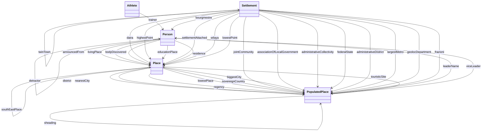

```mermaid
	classDiagram

    
    class Person {
    
    }

    class Place {
    
    }

    class PopulatedPlace {
    
    }

    class Athlete {
    
    }

    class Settlement {
    
    }


Person  --> Place   :announcedFrom  

Place  --> Place   :closeTo  

Person  --> Place   :livingPlace  

PopulatedPlace  --> PopulatedPlace   :largestCity  

Person  --> Place   :bodyDiscovered  

Place  --> Place   :northWestPlace  

Place  --> PopulatedPlace   :district  

Place  --> Place   :westPlace  

Place  --> PopulatedPlace   :nearestCity  

Place  --> PopulatedPlace   :regency  

Place  --> Place   :supply  

Place  --> Place   :mainIsland  

Place  --> Place   :previousEntity  

Place  --> Place   :endPoint  

PopulatedPlace  --> PopulatedPlace   :principalArea  

Settlement  --> Place   :daira  

Settlement  --> Settlement   :canton  

Settlement  --> Place   :highestPoint  

Place  --> PopulatedPlace   :lowestPlace  

Place  --> Place   :northPlace  

Person  --> Person   :parent  

Person  --> Person   :colleague  

Place  --> Place   :northEastPlace  

Settlement  --> Settlement   :adjacentSettlement  

PopulatedPlace  --> PopulatedPlace   :borough  

Athlete  --> Person   :trainer  

Person  --> Person   :sibling  

Place  --> PopulatedPlace   :sovereignCountry  

Person  --> Place   :educationPlace  

Person  --> Person   :friend  

PopulatedPlace  --> PopulatedPlace   :oldDistrict  

Settlement  --> Place   :settlementAttached  

Settlement  --> Settlement   :mergedSettlement  

Person  --> Person   :relative  

Person  --> Person   :opponent  

Place  --> Place   :eastPlace  

PopulatedPlace  --> PopulatedPlace   :neighboringMunicipality  

Settlement  --> PopulatedPlace   :jointCommunity  

Person  --> Person   :copilote  

Person  --> Person   :child  

PopulatedPlace  --> PopulatedPlace   :lieutenancyArea  

Person  --> Person   :cousurper  

PopulatedPlace  --> PopulatedPlace   :arrondissement  

Place  --> PopulatedPlace   :biggestCity  

Settlement  --> Settlement   :twinTown  

Place  --> Place   :subregion  

Person  --> Place   :residence  

Place  --> Place   :land  

Place  --> Place   :hasOutsidePlace  

PopulatedPlace  --> Person   :leaderName  

Settlement  --> PopulatedPlace   :associationOfLocalGovernment  

Place  --> Place   :locatedInArea  

PopulatedPlace  --> PopulatedPlace   :ceremonialCounty  

PopulatedPlace  --> Place   :touristicSite  

Settlement  --> Person   :bourgmestre  

Person  --> Person   :spouse  

Place  --> Place   :nextEntity  

Person  --> Person   :collaboration  

Settlement  --> PopulatedPlace   :administrativeCollectivity  

Settlement  --> Place   :wilaya  

Settlement  --> PopulatedPlace   :federalState  

Person  --> Person   :relation  

Place  --> Place   :hasInsidePlace  

Person  --> Person   :dubber  

PopulatedPlace  --> PopulatedPlace   :largestSettlement  

Place  --> Place   :southWestPlace  

Person  --> Person   :usurper  

PopulatedPlace  --> Person   :viceLeader  

PopulatedPlace  --> PopulatedPlace   :oldProvince  

Person  --> Person   :student  

Settlement  --> PopulatedPlace   :administrativeDistrict  

Settlement  --> PopulatedPlace   :largestMetro  

PopulatedPlace  --> PopulatedPlace   :sheading  

Person  --> Person   :seiyu  

Settlement  --> Place   :lowestPoint  

Settlement  --> PopulatedPlace   :geolocDepartment  

Settlement  --> PopulatedPlace   :frazioni  

Place  --> Place   :southEastPlace  

Person  --> Person   :detractor  

```