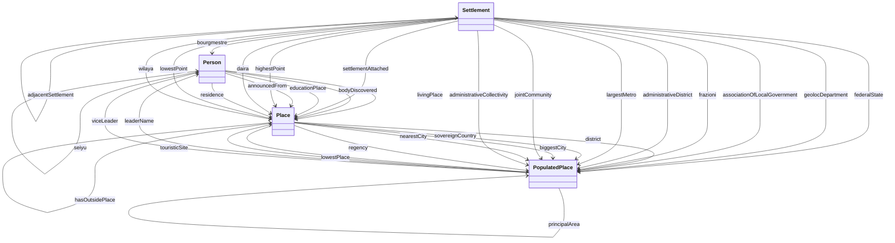

```mermaid
	classDiagram

    
    class Person {
    
    }

    class Place {
    
    }

    class PopulatedPlace {
    
    }

    class Settlement {
    
    }


Settlement  --> Settlement   :mergedSettlement  

Person  --> Person   :colleague  

Settlement  --> Person   :bourgmestre  

Place  --> Place   :land  

PopulatedPlace  --> PopulatedPlace   :lieutenancyArea  

Settlement  --> PopulatedPlace   :federalState  

Place  --> Place   :eastPlace  

Person  --> Place   :livingPlace  

Person  --> Person   :dubber  

PopulatedPlace  --> Place   :touristicSite  

Place  --> Place   :nextEntity  

Place  --> Place   :northEastPlace  

Settlement  --> PopulatedPlace   :geolocDepartment  

Person  --> Person   :cousurper  

Place  --> Place   :locatedInArea  

Settlement  --> PopulatedPlace   :associationOfLocalGovernment  

Place  --> PopulatedPlace   :district  

Place  --> Place   :subregion  

Settlement  --> PopulatedPlace   :frazioni  

PopulatedPlace  --> PopulatedPlace   :sheading  

PopulatedPlace  --> Person   :leaderName  

Person  --> Person   :parent  

Place  --> Place   :closeTo  

PopulatedPlace  --> Person   :viceLeader  

Person  --> Person   :sibling  

Person  --> Place   :bodyDiscovered  

Person  --> Person   :usurper  

Place  --> Place   :endPoint  

Settlement  --> Settlement   :twinTown  

Settlement  --> Settlement   :canton  

Place  --> Place   :northWestPlace  

Place  --> Place   :supply  

PopulatedPlace  --> PopulatedPlace   :arrondissement  

Place  --> Place   :mainIsland  

Settlement  --> Place   :settlementAttached  

Place  --> Place   :previousEntity  

Place  --> Place   :southEastPlace  

Person  --> Person   :collaboration  

Settlement  --> PopulatedPlace   :administrativeDistrict  

Person  --> Person   :friend  

Place  --> Place   :westPlace  

Person  --> Place   :educationPlace  

Place  --> Place   :southWestPlace  

Settlement  --> PopulatedPlace   :largestMetro  

Place  --> Place   :hasInsidePlace  

Place  --> Place   :northPlace  

PopulatedPlace  --> PopulatedPlace   :neighboringMunicipality  

Place  --> PopulatedPlace   :sovereignCountry  

Place  --> PopulatedPlace   :biggestCity  

Settlement  --> PopulatedPlace   :jointCommunity  

PopulatedPlace  --> PopulatedPlace   :borough  

PopulatedPlace  --> PopulatedPlace   :ceremonialCounty  

Person  --> Person   :relation  

PopulatedPlace  --> PopulatedPlace   :oldProvince  

PopulatedPlace  --> PopulatedPlace   :largestCity  

Person  --> Place   :announcedFrom  

Person  --> Person   :child  

Person  --> Person   :detractor  

PopulatedPlace  --> PopulatedPlace   :oldDistrict  

PopulatedPlace  --> PopulatedPlace   :largestSettlement  

PopulatedPlace  --> PopulatedPlace   :principalArea  

Person  --> Person   :relative  

Person  --> Person   :student  

Person  --> Person   :copilote  

Settlement  --> Settlement   :adjacentSettlement  

Place  --> PopulatedPlace   :nearestCity  

Settlement  --> Place   :highestPoint  

Person  --> Person   :opponent  

Settlement  --> PopulatedPlace   :administrativeCollectivity  

Settlement  --> Place   :daira  

Person  --> Person   :spouse  

Place  --> Place   :hasOutsidePlace  

Person  --> Place   :residence  

Place  --> PopulatedPlace   :regency  

Person  --> Person   :seiyu  

Settlement  --> Place   :lowestPoint  

Settlement  --> Place   :wilaya  

Place  --> PopulatedPlace   :lowestPlace  

```