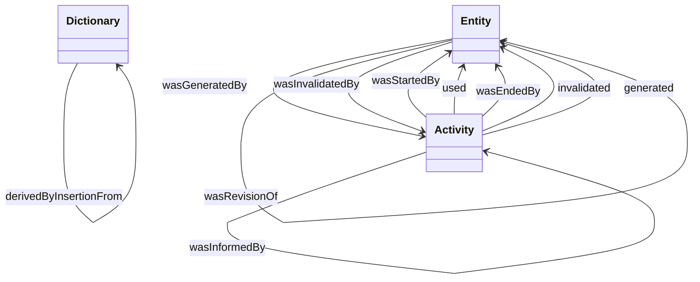

```mermaid
	classDiagram

    
    class Entity {
    
    }

    class Activity {
    
    }

    class Dictionary {
    
    }


Entity  --> Activity   :wasGeneratedBy  

Entity  --> Entity   :hadPrimarySource  

Activity  --> Entity   :wasStartedBy  

Dictionary  --> Dictionary   :derivedByRemovalFrom  

Activity  --> Entity   :used  

Activity  --> Entity   :wasEndedBy  

Dictionary  --> Dictionary   :derivedByInsertionFrom  

Activity  --> Activity   :wasInformedBy  

Entity  --> Entity   :specializationOf  

Activity  --> Entity   :invalidated  

Entity  --> Entity   :wasDerivedFrom  

Entity  --> Activity   :wasInvalidatedBy  

Entity  --> Entity   :wasQuotedFrom  

Entity  --> Entity   :alternateOf  

Entity  --> Entity   :mentionOf  

Activity  --> Entity   :generated  

Entity  --> Entity   :wasRevisionOf  

```