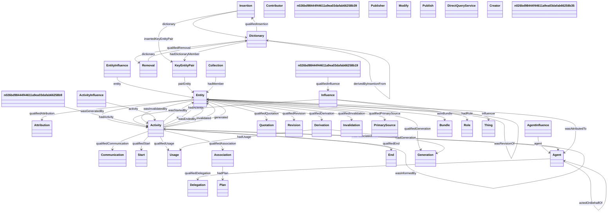

```mermaid
	classDiagram

    
    class Insertion {
    
    }

    class Contributor {
    
    }

    class Communication {
    
    }

    class Entity {
    
    }

    class Start {
    
    }

    class Usage {
    
    }

    class n026bd98444f44611a9ea03dafab66258b39 {
    
    }

    class Influence {
    
    }

    class Agent {
    
    }

    class n026bd98444f44611a9ea03dafab66258b19 {
    
    }

    class Delegation {
    
    }

    class End {
    
    }

    class Attribution {
    
    }

    class Publisher {
    
    }

    class Modify {
    
    }

    class Publish {
    
    }

    class Removal {
    
    }

    class DirectQueryService {
    
    }

    class Activity {
    
    }

    class Association {
    
    }

    class Quotation {
    
    }

    class Revision {
    
    }

    class Generation {
    
    }

    class Creator {
    
    }

    class Derivation {
    
    }

    class Invalidation {
    
    }

    class Dictionary {
    
    }

    class n026bd98444f44611a9ea03dafab66258b35 {
    
    }

    class PrimarySource {
    
    }


Entity  --> Activity   :wasGeneratedBy  

Activity  --> Start   :qualifiedStart  

Entity  --> Entity   :hadPrimarySource  

n026bd98444f44611a9ea03dafab66258b9  --> Activity   :hadActivity  

Association  --> Plan   :hadPlan  

Entity  --> Derivation   :qualifiedDerivation  

Activity  --> Entity   :wasStartedBy  

Insertion  --> Dictionary   :dictionary  

Dictionary  --> Dictionary   :derivedByRemovalFrom  

Activity  --> Entity   :used  

Activity  --> Entity   :wasEndedBy  

AgentInfluence  --> Agent   :agent  

Activity  --> Communication   :qualifiedCommunication  

EntityInfluence  --> Entity   :entity  

Entity  --> Bundle   :asInBundle  

Dictionary  --> Dictionary   :derivedByInsertionFrom  

Activity  --> Activity   :wasInformedBy  

Activity  --> Usage   :qualifiedUsage  

Removal  --> Dictionary   :dictionary  

Agent  --> Agent   :actedOnBehalfOf  

n026bd98444f44611a9ea03dafab66258b19  --> Influence   :qualifiedInfluence  

Insertion  --> KeyEntityPair   :insertedKeyEntityPair  

Agent  --> Delegation   :qualifiedDelegation  

Entity  --> Revision   :qualifiedRevision  

Entity  --> Entity   :specializationOf  

Activity  --> Entity   :invalidated  

Influence  --> Role   :hadRole  

Derivation  --> Usage   :hadUsage  

Entity  --> Generation   :qualifiedGeneration  

Entity  --> PrimarySource   :qualifiedPrimarySource  

KeyEntityPair  --> Entity   :pairEntity  

Dictionary  --> Insertion   :qualifiedInsertion  

Influence  --> Activity   :hadActivity  

Activity  --> End   :qualifiedEnd  

Entity  --> Entity   :wasDerivedFrom  

Entity  --> Activity   :wasInvalidatedBy  

Dictionary  --> Removal   :qualifiedRemoval  

Dictionary  --> KeyEntityPair   :hadDictionaryMember  

Derivation  --> Generation   :hadGeneration  

ActivityInfluence  --> Activity   :activity  

Entity  --> Entity   :wasQuotedFrom  

Entity  --> Entity   :alternateOf  

Activity  --> Agent   :wasAssociatedWith  

Entity  --> Entity   :mentionOf  

Entity  --> Invalidation   :qualifiedInvalidation  

Entity  --> Attribution   :qualifiedAttribution  

Activity  --> Entity   :generated  

Activity  --> Association   :qualifiedAssociation  

Entity  --> Agent   :wasAttributedTo  

Entity  --> Quotation   :qualifiedQuotation  

Entity  --> Entity   :wasRevisionOf  

Collection  --> Entity   :hadMember  

Influence  --> Thing   :influencer  

```